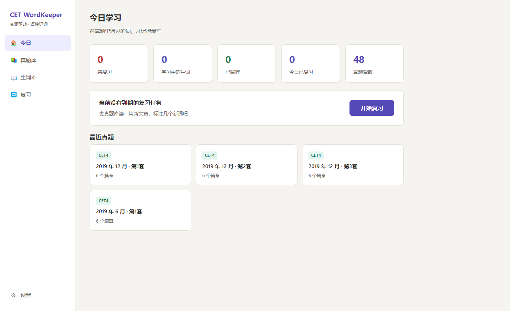
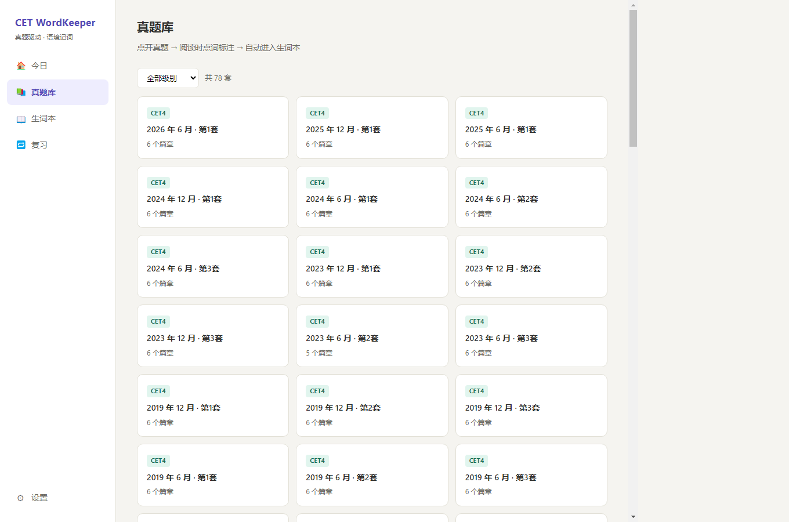
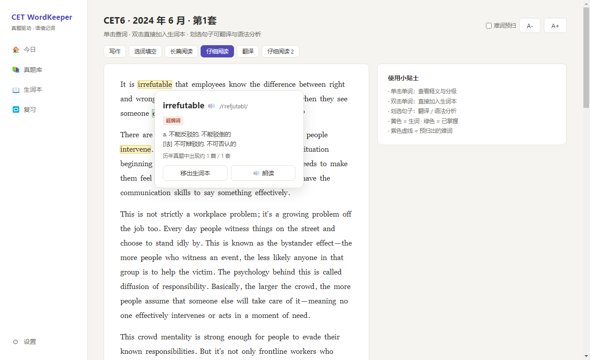
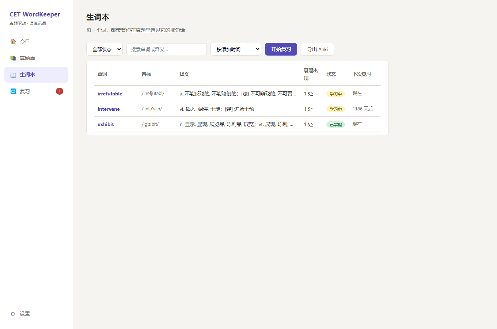
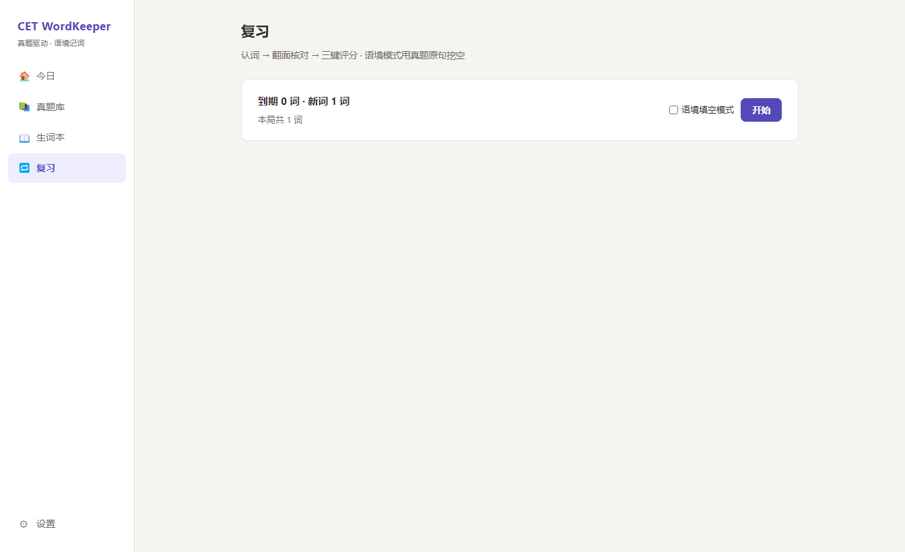
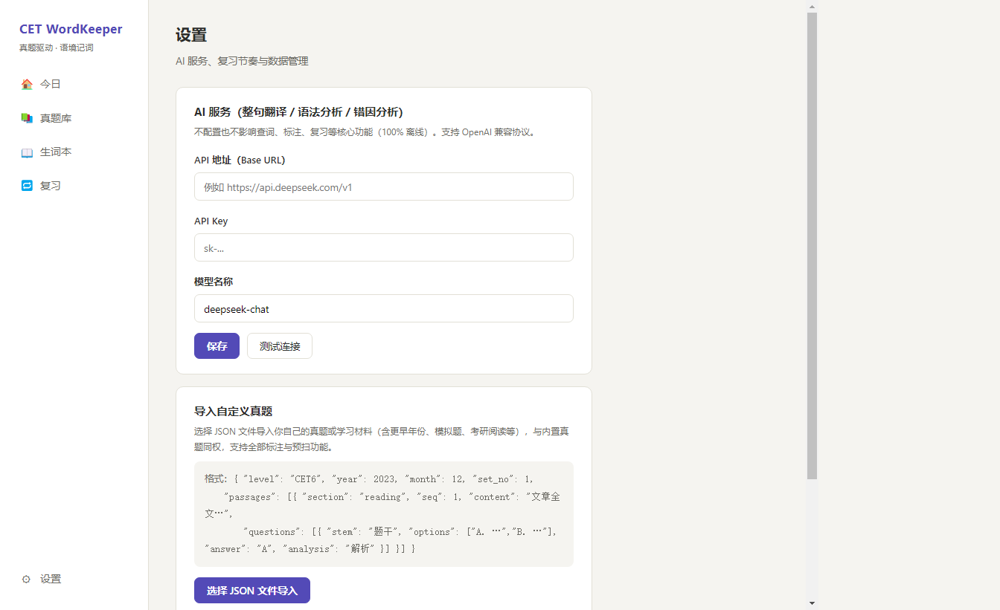

# CET WordKeeper

**真题驱动的四六级学习桌面软件。**
在真题原文里点一下不认识的词，它就带着**出处句子**进入你的生词库，之后按遗忘曲线安排复习。

`Electron 33` · `Vue 3` · `Vite 5` · `sql.js (WASM SQLite)` · `SM-2 间隔重复` · `完全离线可用`

---

## 目录

- [它解决什么问题](#它解决什么问题)
- [界面预览](#界面预览)
- [功能特性](#功能特性)
- [快速开始](#快速开始)
- [AI 配置（可选）](#ai-配置可选)
- [数据说明](#数据说明)
- [扩充真题库](#扩充真题库)
- [导入自定义真题](#导入自定义真题)
- [项目结构](#项目结构)
- [技术栈与设计决策](#技术栈与设计决策)
- [数据模型](#数据模型)
- [复习算法：SM-2](#复习算法sm-2)
- [开发与验证](#开发与验证)
- [常见问题](#常见问题)
- [致谢与许可](#致谢与许可)

---

## 它解决什么问题

大多数背单词 App 的问题是：**你在背一个没有上下文的词表**。你在真题里明明见过这个词、当时不认识，但那个语境在切到背单词 App 的一瞬间就丢失了 —— 你记的是「abandon = 放弃」，而不是「我在那篇讲人工智能的阅读里，读到 *those rules were abandoned* 时没看懂」。

CET WordKeeper 把顺序倒过来：**先把真题读懂，生词在阅读过程中自然沉淀下来**。

```
阅读真题 → 点词查询（自动还原原形）→ 标注入库（连同这一句真题语境）
        → SM-2 间隔复习（在语境中回忆）→ 真正掌握
```

与传统背单词工具的三个差异：

|  | 传统背单词 App | CET WordKeeper |
|---|---|---|
| 词从哪来 | 预设词表（考纲 4500） | **你在真题里真实遇到的词** |
| 记忆锚点 | 孤立的词 + 释义 | **词 + 你遇见它的那句话 + 出处考次** |
| 优先级 | 按词表顺序 | **按该词在全部真题中的出现次数**（高频考词优先） |

---

## 界面预览

| 今日 | 真题库 |
|---|---|
|  |  |

| 阅读器（点词查询 / 划选翻译） | 生词本 |
|---|---|
|  |  |

| 复习（SM-2） | 设置 |
|---|---|
|  |  |

---

## 功能特性

### 阅读器 —— 核心工作台

- **单击任意单词**：弹出释义卡片，显示音标、中文释义、考纲分级标签（四级 / 六级 / 考研 / GRE / 托福雅思）、该词在**全部真题中的出现次数**
- **双击单词**：一键加入生词本，自动记录**你点击的那一句话**作为出处语境
- **划选整句 / 段落**：弹出操作菜单，可调用 AI 做**整句翻译**或**语法结构分析**
- **难词预扫**：打开篇章时自动扫出该篇里的超纲词（GRE/出国级、六级/考研级、低频生僻），一眼看出这篇有几只「拦路虎」，可一键批量加入生词本
- 篇章 / 题目双栏阅读，字号可调（A±）
- 已标注的词在原文中高亮，`learning` 与 `mastered` 两种状态配色区分

### 词典查询 —— 离线毫秒级

- 内置 **ECDICT** 裁剪版 **28,667 条**（考纲词 + 高频词），完全离线，无需联网
- **自动词形还原**：`abandoned → abandon`、`understood → understand`、`intervening → intervene`、`went → go` 都能正确归到原形
- 考纲分级标签，快速判断一个词是「必背」还是「超纲」

### 生词本

- 按状态（学习中 / 已掌握）、来源考次、出现次数筛选
- 每个词展示**全部**真题出处句（同一个词在不同考次出现会累积，不会只留一句）
- 可写私人笔记
- 一键标记已掌握

### 复习系统

- **SM-2 间隔重复算法**（Anki 同源）：三键评分 **忘记 / 模糊 / 记得**，动态计算下次复习日期
- **两种复习模式**：认词（看词想义）、语境填空（把真题原句挖空，在语境中回忆）
- **TTS 朗读**：调用系统语音合成，离线发音
- 键盘快捷键操作，支持连续刷词
- 侧边栏实时显示「今日待复习」数量角标

### 真题导入 / 导出 / 备份

- **Anki 导出**：生词本一键导出为 Anki 可直接导入的 TSV（含音标、释义、挖空例句、出处、标签）
- **自定义真题导入**：导入自制 JSON 真题或任何学习材料，与内置数据**同权**（自动纳入词频统计、难词预扫、标注体系）
- **数据库备份**：一键复制 `keeper.db`，所有学习记录都在这一个文件里

### AI 增强 —— 可选，按需自配

- **整句翻译**、**语法结构分析**
- 兼容 **OpenAI 协议**（DeepSeek / OpenAI / 通义 / Kimi / 任何兼容端点均可）
- **API Key 由你自己配置，软件不内置任何 Key**
- 结果**按内容哈希本地缓存**，同一句只请求一次
- **未配置 Key 时优雅降级**：所有核心功能（查词、标注、复习）100% 离线可用，只有 AI 按钮会提示需要配置

---

## 快速开始

### 环境要求

- **Node.js ≥ 18**（开发时使用 22.x）
- Windows / macOS / Linux 均可（打包脚本以 Windows 为主）

### 从源码运行

```bash
# 1. 安装依赖
npm install

# 2. 构建前端界面
npm run build

# 3. 启动应用
npm start
```

Windows 用户也可以直接双击 **`start.cmd`**（会自动检测并构建前端后启动）。

### 打包成可执行程序（免装 Node）

```bash
npm run pack:win
```

产物在 `release/` 目录：

| 文件 | 说明 |
|---|---|
| `CET-WordKeeper-<版本>-便携版.exe` | **单文件绿色版**，双击即用，无需安装（推荐） |
| `CET-WordKeeper-<版本>-安装包.exe` | 向导式安装，自动创建桌面与开始菜单快捷方式 |

> 首次打包会下载 Electron 运行时（约 100MB）。国内网络建议先设置镜像：
> ```bash
> set ELECTRON_MIRROR=https://npmmirror.com/mirrors/electron/
> set ELECTRON_BUILDER_BINARIES_MIRROR=https://npmmirror.com/mirrors/electron-builder-binaries/
> ```

---

## AI 配置（可选）

打开「设置」页填写：

| 字段 | 示例 |
|---|---|
| API 地址 | `https://api.deepseek.com/v1` |
| API Key | 你自己的 Key |
| 模型 | `deepseek-chat` |

填完点「测试连接」可验证是否可用。

**不配置也完全不影响核心功能**。AI 只用于两个地方：整句翻译、语法结构分析。查词、标注、生词本、复习全部离线。

---

## 数据说明

内置数据位于 **`data/keeper.db`**（单文件，约 8.5MB）：

| 数据 | 规模 |
|---|---|
| 词典 | **28,667 条**（ECDICT 裁剪：考纲词 + 高频词，含音标 / 释义 / 词频 / 词形变化） |
| 真题 | **78 套** —— 四级 32 套（2014–2026）、六级 46 套（2014–2026） |
| 题型 | 写作、选词填空、长篇阅读、仔细阅读、翻译（不含听力，听力对照功能未纳入范围） |
| 真题词频表 | **7,963 条**实词，跨全部真题按原形归并统计 |

### 数据放在哪

首次启动时，软件会把种子库 `data/keeper.db` 复制到用户数据目录：

```
Windows:  %APPDATA%\cet-wordkeeper\keeper.db
macOS:    ~/Library/Application Support/cet-wordkeeper/keeper.db
Linux:    ~/.config/cet-wordkeeper/keeper.db
```

此后**所有学习记录都写在这个文件里**，升级软件不会覆盖你的数据。备份 = 复制这个文件（设置页提供「备份到…」按钮）。

> 删除该文件后重启，会从 `data/keeper.db` 重新初始化 —— **学习记录会丢失，请先备份**。

---

## 扩充真题库

数据管线可复现。**旧考次走 docx，新考次走 PDF**，两条支线最终都产出同构的 JSON 并汇入同一个数据库：

```bash
# 0. 只克隆文件树（几 MB，规避 GitHub API 限流）
git clone --filter=blob:none --no-checkout --depth 1 \
  https://github.com/0609x/CET46-Resources.git data/raw/repo

# 1) Word 版（覆盖 2014–2019，质量最好）
node scripts/fetch-exams.mjs 2014

# 2) PDF 版（2020 年起只有 PDF）
node scripts/fetch-pdf-exams.mjs 2022

# 3. 重建数据库
node scripts/build-db.mjs
```

> **注意**：步骤 3 需要 ECDICT 源库。从 [ECDICT Releases](https://github.com/skywind3000/ECDICT/releases) 下载
> `ecdict-sqlite-28.zip`，解压出 `stardict.db` 放到 `data/raw/ecdict-sqlite/stardict.db`。
>
> PDF 支线还需要 Python 与 `pypdf`（`pip install pypdf`），可用环境变量 `PDF_PYTHON` 指定解释器路径。

### 两条支线各自踩过的坑

**套号解析（docx）**：源仓库命名极不统一 —— `第1套` / `第一套` / `卷二` / `（全1套）` / `真题1` / `（第三套)` 都有。早期只认「第N套」和「（汉字）」，导致「第一套/第二套/第三套」全被当成第 1 套互相覆盖、**静默丢题**（四级因此少了 9 套）。现在用多模式提取 + 撞名检测，并在每次运行后把不再产出的旧文件移入 `data/seed/_stale/`。

**文本层（PDF）**：近年 PDF **质量参差且与命名无关** —— 同一考次的不同命名可能一个是重排版（有完整文本层）、一个是纯扫描图（只能提出十几个字符）。所以不按命名猜，而是逐个尝试 + 质量门禁判定。抽取出的文本还有两类特有噪声，都在 `parse-pdf.mjs` 里处理：

| 现象 | 例子 | 处理 |
|---|---|---|
| 罗马数字被判读成字母 | `Part III` → `Part in` | Part 编号用宽松匹配 |
| 非 ASCII 罗马数字无词边界 | `PartⅡ Listening` | 匹配式不能用 `\b` 收尾 |
| 选项两栏排版 | `A) … C) …` / `B) … D) …` | 按 `A)`~`D)` 标记切分 |
| 词库被排出 Section 外 | 词库行夹在 Section B 段落中 | 全局扫描词库行并剔除 |
| 正文续行像题号 | `47 hours in the United States…` | 题号必须带小数点且落在 36–45 / 46–55 区间 |

关于数据源的实际情况：

- 公开源只有 **Word 版覆盖 2014–2019**（四级 21 套 / 六级 40 套的 docx），2020 年起一律 PDF
- 源仓库中 4 份 docx 本身残缺（`cet6-2018.06-set2/set3`、`cet6-2020.09-set3`、`cet6-2022.06-set3`），解析器按长度阈值**正确拒绝**而非产出脏数据
- 仍有约 17 个考次只有纯扫描 PDF（提不出文本），需要 OCR 才能使用，故未纳入
- 想补充遗漏考次，用下面的「导入自定义真题」即可

---

## 导入自定义真题

在「设置 → 导入自定义真题」选择一个 JSON 文件。格式：

```json
{
  "level": "CET6",
  "year": 2023,
  "month": 12,
  "set_no": 1,
  "title": "CET6 2023 年 12 月第 1 套",
  "passages": [
    {
      "section": "reading",
      "seq": 1,
      "title": "仔细阅读 · Passage One",
      "content": "文章全文……",
      "questions": [
        {
          "qtype": "reading",
          "stem": "题干文字",
          "options": ["A) 选项一", "B) 选项二", "C) 选项三", "D) 选项四"],
          "answer": "A",
          "analysis": "题目解析"
        }
      ]
    }
  ]
}
```

字段说明：

| 字段 | 必填 | 说明 |
|---|---|---|
| `level` | ✅ | `CET4` / `CET6` |
| `year` / `month` | ✅ | 考次年月，如 `2023` / `12` |
| `set_no` | | 套号，默认 1 |
| `passages[].section` | | `writing` / `cloze` / `match` / `reading` / `translation`，默认 `reading` |
| `passages[].content` | ✅ | 篇章正文（**单词标注功能就工作在这段文本上**） |
| `passages[].questions[]` | | 题目，可留空数组 |

导入后：

- 自动归类到「真题库 → 我的导入」
- 自动**重建词频表**，新导入的篇章会纳入统计
- 与内置真题**同权**：可点词标注、可难词预扫
- **重复导入会被拦截**（同 `level + 年 + 月 + 套号` 视为同一套，避免堆积副本）

---

## 项目结构

```
cet-wordkeeper/
├── electron/
│   ├── main.cjs             # 主进程：数据库、IPC、词典索引、SM-2、AI 网关
│   └── preload.cjs          # contextBridge 安全桥接（白名单 API）
├── src/                     # Vue 3 渲染层
│   ├── views/
│   │   ├── HomeView.vue       # 今日：待复习、学习概览
│   │   ├── ExamLibrary.vue    # 真题库：按级别/年份浏览
│   │   ├── ReaderView.vue     # 阅读器：点词、划选、难词预扫
│   │   ├── WordBook.vue       # 生词本：筛选、详情、Anki 导出
│   │   ├── ReviewView.vue     # 复习：SM-2 卡片流、语境填空
│   │   └── SettingsView.vue   # 设置：AI 配置、导入、备份
│   ├── utils/tokens.js      # 分词、词形归并、句子切分
│   ├── router.js            # hash 路由
│   └── styles.css           # 设计系统（纸张质感、标注配色）
├── scripts/                 # 数据工程与验证
│   ├── fetch-exams.mjs      # 抓取 docx 真题（blobless clone + raw 下载）
│   ├── parse-docx.mjs       # docx → 结构化 JSON（含标点空格修补）
│   ├── fetch-pdf-exams.mjs  # 抓取近年 PDF 真题（带文本层质量门禁）
│   ├── parse-pdf.mjs        # PDF 提取文本 → 结构化 JSON
│   ├── pdf-extract.py       # pypdf 抽文本（被 fetch-pdf-exams 调用）
│   ├── scan-pdf-quality.mjs # 抽样扫描 PDF 文本层质量
│   ├── build-db.mjs         # ECDICT 裁剪 + 真题导入 + 粘连词修补 → keeper.db
│   ├── smoke-test.mjs       # 数据层冒烟测试
│   ├── e2e-check.mjs        # 端到端功能验证（CDP，40 项断言，含界面级）
│   ├── verify-all.mjs       # 启动 + 验证 + 清理 编排
│   ├── word-audit.mjs       # 词典查得率审计
│   └── capture-shots.mjs    # 自动截取文档用截图（独立 user-data-dir）
├── data/
│   ├── keeper.db            # 种子数据库（随软件分发）
│   ├── seed/                # 结构化真题 JSON（78 套）
│   └── raw/                 # 原始素材（已 gitignore，用管线重新获取）
├── docs/screenshots/        # README 配图
├── electron-builder.json    # 打包配置（portable + nsis）
└── start.cmd                # Windows 一键启动
```

---

## 技术栈与设计决策

| 决策 | 选择 | 原因 |
|---|---|---|
| 桌面壳 | **Electron 33** | 有 Node 就能跑，不需要 Rust / VC++ 原生工具链 |
| 数据库 | **sql.js（WASM SQLite）** | 免原生编译；数据库是**单个 .db 文件**，备份 = 复制文件 |
| 前端 | **Vue 3 + Vite 5** | 构建快（< 1s）、产物小（约 125KB JS） |
| 数据存储 | 单文件 SQLite | 用户数据与词典、真题同库，无需多文件管理 |
| 打包 | **electron-builder** | 同时产出便携版与安装包 |
| 端到端验证 | **CDP（Chrome DevTools Protocol）** | 不依赖 Playwright/Spectron，直连渲染进程执行断言 |

**为什么不用 better-sqlite3**：它需要原生编译，在没有构建工具链的机器上装不上。sql.js 是纯 WASM，`npm install` 即用，且天然跨平台。

**为什么阅读器要自己做分词渲染**：把篇章正文按词切成 `<span>`，每个词可独立响应点击与高亮，比用 `window.getSelection()` 判断落点更可靠，也更容易做「整段批量渲染 + 局部高亮更新」的性能优化。

**ECDICT 词形还原的关键坑**：ECDICT 的 `exchange` 字段中，`0:` 表示**原形指针**（最高可信），其余 `p/d/i/3/s` 才是变形列表。最初把两者搞反，导致 `intervene` 被错误映射到 `intervening`。现在的实现采用「**变形优先**」策略：先当作某词条的变形去找原形，找不到再退到精确匹配。

**IPC 不能直接传 Vue 的响应式对象**：`ipcRenderer.invoke` 走结构化克隆，而 `ref` / `reactive` 的 `.value` 是 Proxy，克隆会抛 `An object could not be cloned.`。更麻烦的是**失败是静默的** —— 调用方的 `await` 直接 reject，界面表现成「页面永远加载不出内容」。生词本、Anki 导出、设置保存都曾因此失效。现在 `preload.cjs` 用 `plain()` 统一把对象载荷降级成普通对象兜底，调用点也显式展开成普通对象。

> 这个 bug 也暴露了测试策略上的一个教训：如果只测 `window.keeper.*` 这类 IPC 层调用，**再多的断言也测不出「页面调不通」**。所以 `e2e-check.mjs` 里专门加了一组**界面级断言** —— 直接驱动 UI（切到生词本页面断言表格渲染、在设置页填值后点「保存」再读回），覆盖真实用户路径。

### 两个源数据质量问题与处理

真题 docx 是第三方整理的，本身带有排版瑕疵。这两类问题在文本层修掉，否则会直接影响「点词查询」：

**1. 标点后丢空格**（全库约 900 处）

源文档里大量出现 `Directions:For`、`part,you`、`world.”You`、`essay.You`。解析阶段统一修补，只处理几乎不可能是缩写的组合，避免误伤 `U.S.` / `10:30` / `1,000` / `don't`：

```js
.replace(/([,;:])(?=[A-Za-z])/g, '$1 ')            // 逗号/分号/冒号后紧跟字母
.replace(/([”])(?=[A-Za-z])/g, '$1 ')               // 右双引号后紧跟字母
.replace(/(?<=[a-z])\.(?=[A-Z][a-z]{2,})/g, '. ')   // 句点后紧跟大写起首的词
```

**2. 两词粘连**（全库 17 处）

例如 `ofdigital`、`thepassage`、`theirjob`。这类瑕疵**无法与合法复合词通用区分**（`smartphone`、`chatbot`、`byproduct` 都是合法的），所以不做通用切分，只修补一个高精度子集：**以不可能是复合词前缀的词开头，且剩余部分恰为词典收录的词**。

| 前缀 | 最小剩余长度 | 理由 |
|---|---|---|
| `of` | 4 | 否则 `often` 会被切成 `of ten` |
| `the` | 5 | 排除 `therein` → `the rein` 之类的边缘情况 |
| `their` | 3 | `their` 开头除 `theirs` 外无其他英文词，可放宽 |

实测命中全部为真瑕疵，无误伤；`healGlued()` 在构建 DB 时执行并打印修补条数。

### 词典查得率

内置词典是 ECDICT 的**裁剪版**，仅收录考纲词 + 高频词。裁剪的副作用是个别高频屈折形式会漏掉 —— 例如 ECDICT 里 `be` 的 `exchange` 并不包含 `are` / `were`（`left`、`found` 这类本身是独立词的例外）。

`electron/word-forms.json` 提供一层**兜底词形映射**（不规则动词 / 不规则复数 / 常见缩写），在词典精确匹配与规则化还原都失败后才生效，因此**不会覆盖词典自身的释义**。

用 `scripts/word-audit.mjs` 可以量化验证（走真实 lookup 链路，审计语料高频词）：

```
node scripts/word-audit.mjs 500
→ 查得率: 500/500 = 100.0%
```

> 已知取舍：`left`/`found` 这类既是屈折形式又是独立词的词，遵循「变形优先」会归到 `leave`/`find`。这是为了 `intervening → intervene` 这类场景做的取舍。

---

## 数据模型

```sql
exam(id, level, year, month, set_no, title, imported, created_at)
passage(id, exam_id, section, seq, title, content)
question(id, passage_id, qtype, stem, options, answer, analysis)
dict(word PK, phonetic, translation, definition, tag, bnc, frq,
     exchange, collins, oxford)
user_word(id, word UNIQUE, status, note, created_at, mastered_at,
     interval_days, ease, reps, lapses, due)          -- SM-2 调度字段
word_hit(id, word, passage_id, sentence)              -- 生词的真题出处句
review_log(id, word_id, mode, rating, reviewed_at, interval_days, ease, due)
mistake(id, question_id, user_answer, ai_analysis, created_at, redone)
ai_cache(hash PK, kind, response, created_at)         -- AI 结果缓存
word_freq(word PK, total, exams)                      -- 跨真题词频（按原形归并）
settings(key PK, value)
```

设计要点：

- `word_hit` 与 `user_word` 分离：一个生词可以在多套真题里出现，每条出处独立成行，详情页展示全部
- `word_freq` 按**原形**归并：`intervene / intervened / intervening` 都会累计到 `intervene`，所以「考频」反映的是这个词根的真实热度
- `ai_cache` 用内容哈希做键，同一句话重复点击不会重复花钱

---

## 复习算法：SM-2

采用 Anki 同源的 SM-2 间隔重复算法，三键评分：

| 评分 | 含义 | 行为 |
|---|---|---|
| `0` 忘记 | 完全想不起来 | 间隔重置为 **10 分钟**，ease −0.2，lapses +1 |
| `1` 模糊 | 想起来了但很勉强 | 间隔按 ease 缩短推进，ease 略降 |
| `2` 记得 | 轻松回忆 | 间隔 × ease，ease +0.1 |

连续「记得」的实际调度序列（模拟验证）：

```
1d (ease 2.60) → 6d (ease 2.70) → 16.2d (ease 2.80) → 45.4d (ease 2.90) → 131.7d (ease 3.00)
```

`ease` 下限有保护，避免连续忘记后间隔永远卡在最小值的死循环。

---

## 开发与验证

```bash
# 开发模式（Vite HMR）
npm run dev          # 另开终端：npm start

# 数据层冒烟测试：词典 / 词形还原 / 词频 / SM-2 调度
node scripts/smoke-test.mjs

# 端到端：启动应用 → 跑 40 项断言 → 清理用户数据
node scripts/verify-all.mjs

# 词典查得率审计（走真实 lookup 链路，统计语料高频词的覆盖）
node scripts/word-audit.mjs 500

# 验证「打包产物」而非开发态（能抓出 asar 路径、wasm 解包等问题）
ELECTRON_EXE="release/win-unpacked/CET WordKeeper.exe" node scripts/verify-all.mjs

# 重新生成 README 配图
node scripts/capture-shots.mjs
```

端到端验证覆盖 **40 项**断言，其中包含一组**界面级断言**（直接驱动 UI，而不只是调 IPC）：

- 基础：界面渲染与导航、IPC 可用性、真题列表与篇章完整度
- 文本质量：标点空格与粘连词已修补、词形还原（含不规则变形与缩写）
- 核心链路：标注入库与幂等、出处句累积、词频归并、难词预扫、SM-2 三档评分数值、状态流转
- 边界：**AI 未配置时的降级**、Anki 导出文件内容、真题导入与重复拦截、数据库备份
- **界面级**：切到生词本页面断言表格真实渲染出词条；在设置页填值 → 点「保存」→ 读回验证真的落库

> 两个易踩的坑（`verify-all.mjs` 已内置处理）：
> 1. 应用只在用户库**不存在**时才从种子库初始化，所以验证前必须先删掉 `%APPDATA%\cet-wordkeeper\keeper.db`，否则会拿残留数据跑断言；
> 2. 截图 / 审计脚本使用独立的 `--user-data-dir`，即使中途被杀也不会污染用户数据。
>
> 改动数据或解析器后，请务必跑一遍 `verify-all.mjs` 确认全绿。

---

## 常见问题

**启动后白屏 / 报 GPU 错误**
部分虚拟机或无显卡环境需要软件渲染：

```bash
node_modules\electron\dist\electron.exe . --disable-gpu --no-sandbox
```

**启动报 `app.whenReady is not a function`**
说明 `ELECTRON_RUN_AS_NODE=1` 被设置了，Electron 退化成 Node 进程运行。清除该环境变量后再启动（`start.cmd` 已内置处理）。

**导入更多真题后词频没更新**
通过界面「设置 → 导入」会自动重建词频表；如果你是手动往 `data/seed/` 加文件，需要重新执行 `node scripts/build-db.mjs`。

**AI 功能点击没反应**
「设置」页填写 API 地址与 Key 后点「测试连接」。未配置时相关按钮会提示，属预期行为，不影响离线功能。

**想换台电脑继续用**
复制 `%APPDATA%\cet-wordkeeper\keeper.db` 到新机器的同路径即可，或直接用「设置 → 备份到…」。

---

## 致谢与许可

**数据来源**

- **ECDICT** —— 开源英中词典数据库，作者 skywind3000（MIT）
- **CET46-Resources** —— 历年四六级真题整理，作者 0609x
- **SM-2** 算法 —— SuperMemo 提出，Anki 的实现作为参考

**许可**

代码以 **MIT** 许可开源，见 [LICENSE](LICENSE)。

**真题原文版权归各自权利人所有。** 本项目仅提供个人学习用途的工具，不随附任何真题原文的商业分发；仓库中的预置数据仅为个人学习索引便利，请勿用于商业用途。
